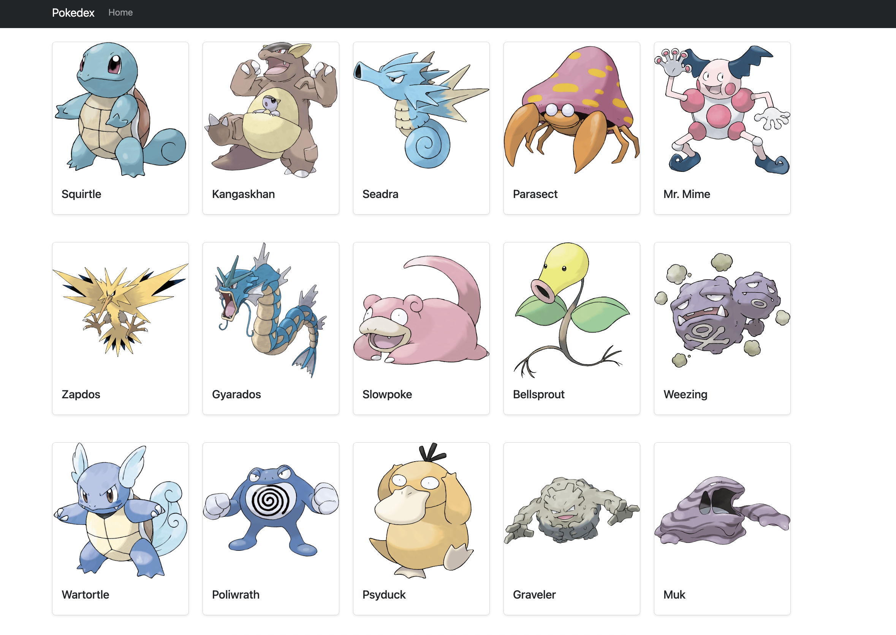

# 🧬 Amazon Pokédex – Fullstack Serverless Pokémon App

Welcome to **Amazon Pokédex**, a fullstack web application built from scratch using modern web technologies and AWS serverless services.

---

##Home preview

---

## 🚀 Project Overview

This application allows users to view a list of Pokémon and access detailed pages for each, displaying images, type, stats, and evolution data. It was built during the **Amazon Engagement Program – Software Developer Track** over a two-day hands-on workshop using tools like **React**, **Next.js**, **AWS Lambda**, **API Gateway**, **DynamoDB**, and **AWS Amplify**.

---

## 🛠️ Technologies & Tools Used

### ⚙️ Frontend

- **Next.js 15** – React framework with App Router
- **TypeScript** – For static typing and robust components
- **React Bootstrap** – For responsive and styled UI components
- **AWS Amplify Hosting** – Static site hosting for production
- **Client-side components** – Marked with `"use client"`

### ☁️ Backend (Serverless)

- **AWS Lambda** – Functions for listing and retrieving Pokémon from DynamoDB
- **Amazon API Gateway** – Public endpoint exposure (`/pokemon` and `/pokemon/{id}`)
- **Amazon DynamoDB** – NoSQL database for storing Pokémon data
- **AWS SAM** – For automated backend deployment
- **IAM Policies** – Managed permissions for secure DynamoDB access

### 🧰 Dev & Deployment

- **AWS Amplify** – CI/CD with GitHub integration
- **GitHub** – Version control and source code storage
- **Postman / cURL** – API testing
- **Next.js rewrites** – CORS-free local API proxying
- **Fallback via public/pokemons.json** – For offline development after workshop ends

---

## 📚 What I Learned

- Setting up a fullstack Next.js + TypeScript app from scratch
- Creating reusable React components like `PokemonCardComp`, `PokemonTypeBadgeComp`, `PokemonsComp`
- Connecting a frontend to a real serverless backend
- Consuming secured RESTful endpoints from the frontend
- Structuring and querying DynamoDB tables
- Using `useEffect` and `useState` to manage state in React
- Deploying with AWS Amplify linked to GitHub
- Avoiding CORS issues with Next.js proxy rewrites
- Creating a public fallback data source for local dev (`pokemons.json`)

---
